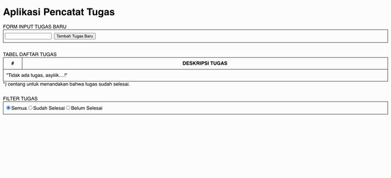

## Latihan React JS Bagian 2 - Redux Lanjutan
Project ini merupakan bagian dari seri tutorial react JS yang disediakan oleh microdata.

### Sebelum Memulai
Pastikan git sudah terinstall di komputer anda, 
jika belum, panduannya bisa dilihat [disini](https://git-scm.com/book/en/v2/Getting-Started-Installing-Git).<br />

### Pemasangan
Clone repository.<br />
Jalankan perintah dibawah ini untuk mengambil repositori
```
git clone git@github.com:cooljar/reactJs-2-ReduxLanjutan.git
```

Masuk ke direktori project dengan menjalankan perintah berikut
```
cd reactJs-2-ReduxLanjutan
```

Memasang semua paket dependency dengan menjalankan perintah berikut
```
npm install
```

### Menjalankan Aplikasi
Jalankan perintah berikut untuk mulai menjalankan aplikasi
```
npm start
```
Buka browser dan ketikan alamat: http://localhost:3000

### Contoh Tampilan


### Apa Yang Harus Diselesaikan Pada Latihan Ini
Pada latihan ini kita membuat aplikasi pencatat tugas sederhana dengan fitur sebagai berikut: 
- Menambahkan tugas baru
- Ceklist tugas untuk menandakan bahwa tugas sudah diselesaikan
- Filter tugas, untuk menampilkan daftar tugas berdasarkan semua tugas, yang sudah selesai, dan yang belum dikerjakan.

### Contoh Hasil Aplikasi

